# LuKK XHS Poster Studio

小红书长文卡片排版工具。可以直接在输入框里写，也可以把已经写好的 Markdown 长文贴进去，自动分页、套主题、微调排版，然后批量导出 3:4 PNG 卡片。

适合边写边预览，也适合先在文档、笔记或聊天记录里把内容写清楚，再快速变成一组能发布、能连续阅读的小红书图文卡片。

## 导出效果

<table>
  <tr>
    <td>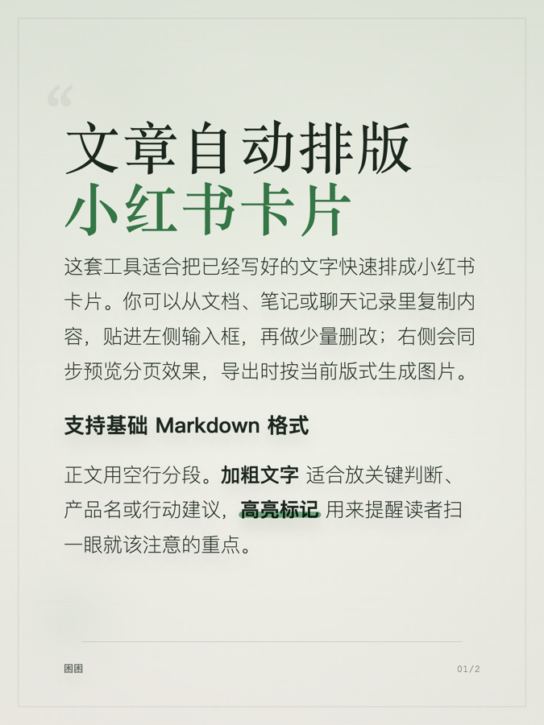</td>
    <td>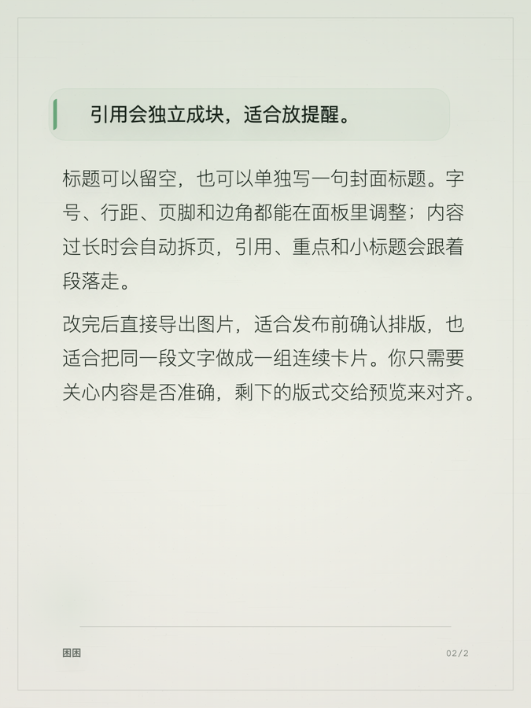</td>
  </tr>
</table>

## 更多主题

<table>
  <tr>
    <td>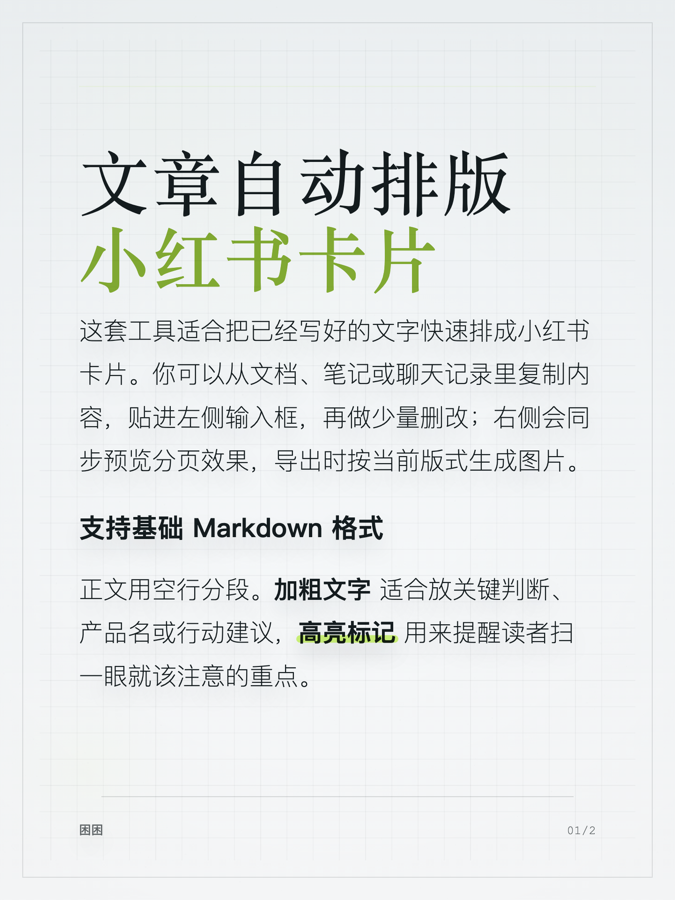</td>
    <td>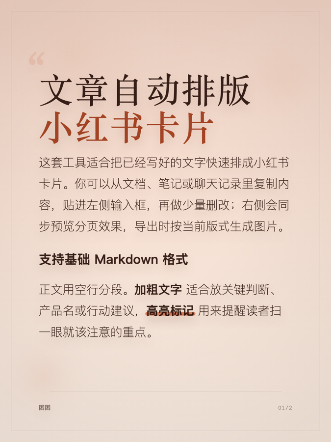</td>
    <td>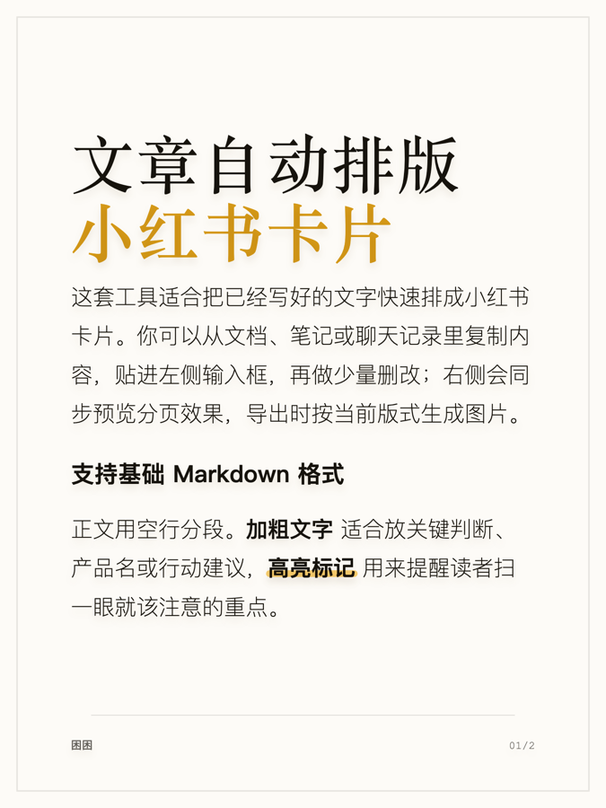</td>
  </tr>
  <tr>
    <td>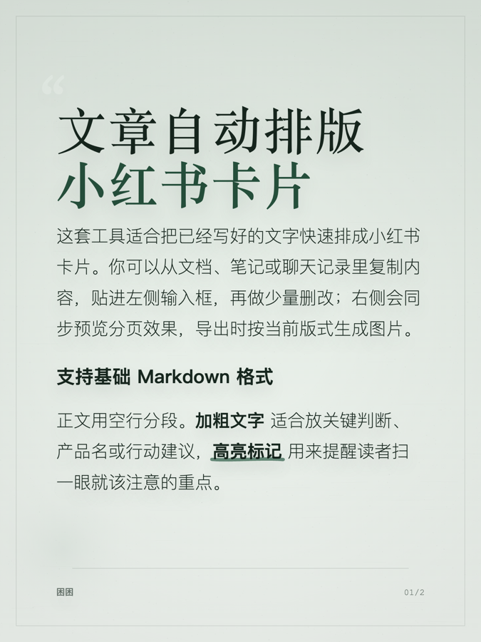</td>
    <td>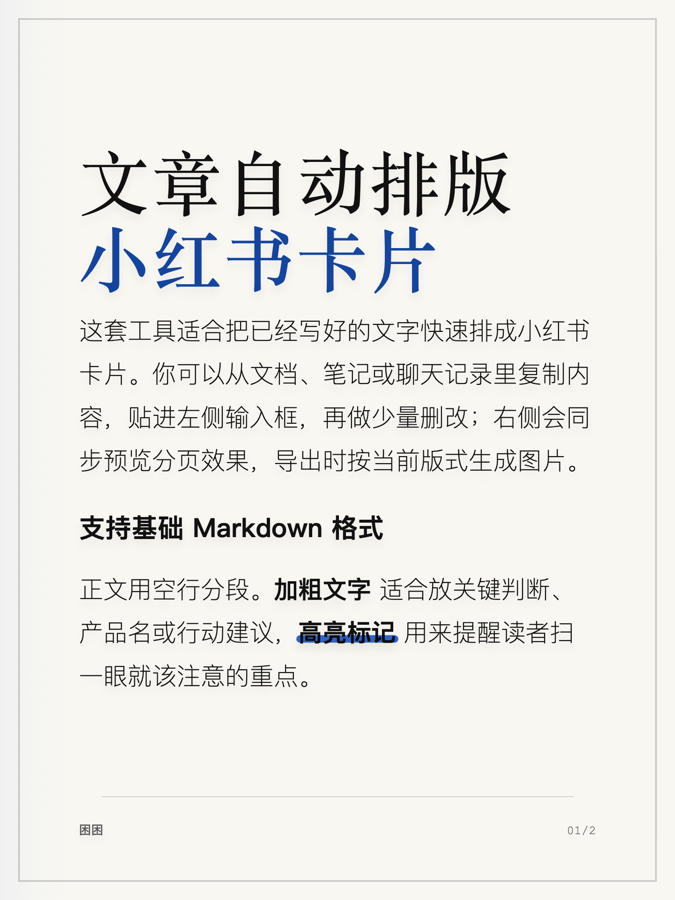</td>
    <td>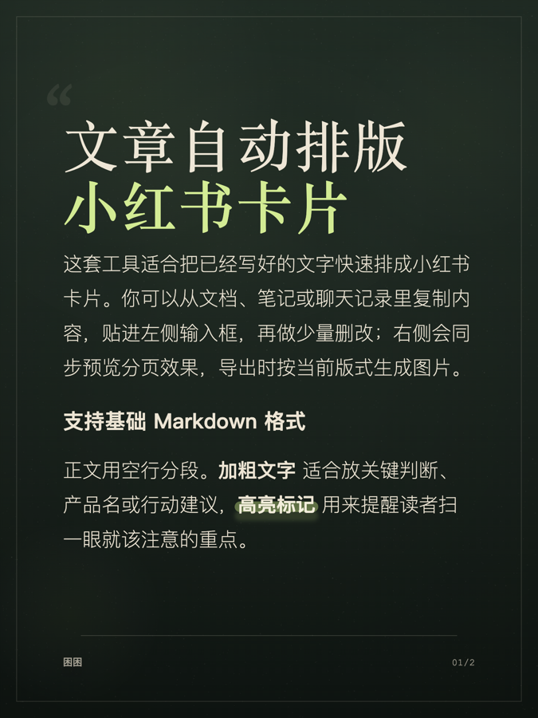</td>
  </tr>
  <tr>
    <td>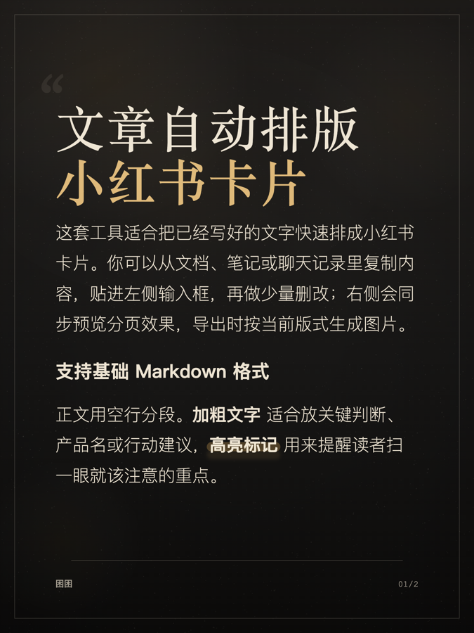</td>
    <td></td>
    <td></td>
  </tr>
</table>

## 界面预览

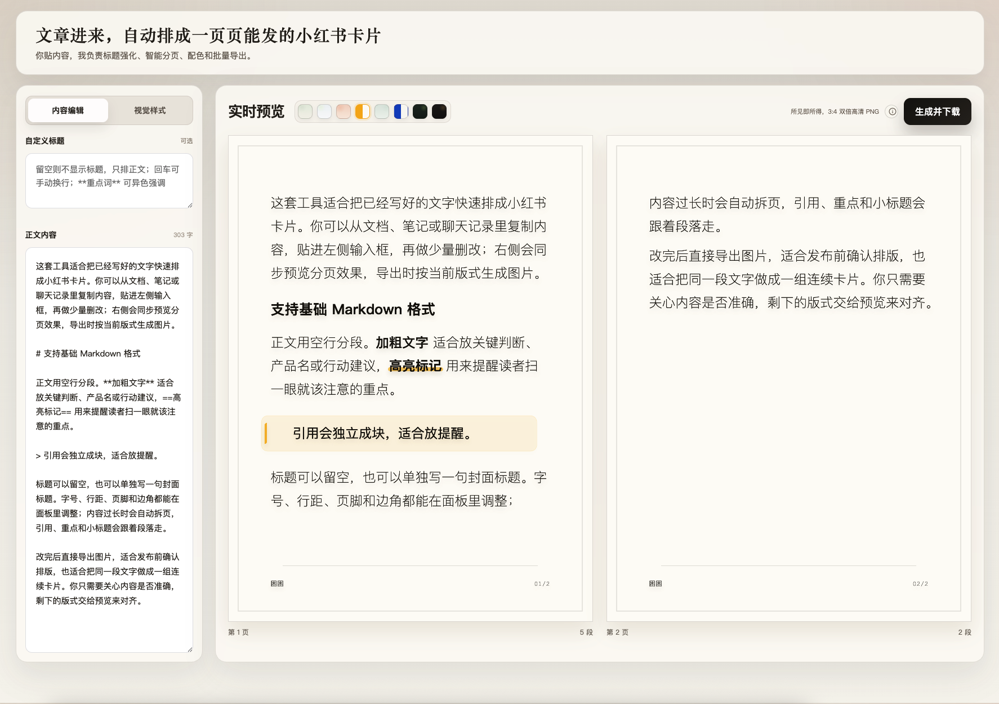

## 适合做什么

- 把长文、笔记、口播稿改成小红书图文卡片
- 用 Markdown 保留标题、引用、加粗和高亮
- 自动拆页，减少手动排版时间
- 在多个视觉主题之间快速切换
- 导出按顺序命名的 PNG 图片，方便直接发布

## 功能

- **智能分页**：正文过长时自动拆成多张卡片。
- **Markdown 支持**：支持小标题、引用、`**加粗**`、`==高亮==` 和空行分段。
- **多套主题**：浅底、暖色、冷色、深色主题都可切换。
- **排版微调**：标题字号、正文字号、行距、标题字体、小标题样式和高亮样式都可调整。
- **页脚控制**：可以显示或关闭页脚，左下角可作为账号名/署名/栏目名，右下角可显示页码或日期。
- **批量导出**：逐张下载 PNG。文件名会带标题、页码和时间戳，避免多次导出时重名。

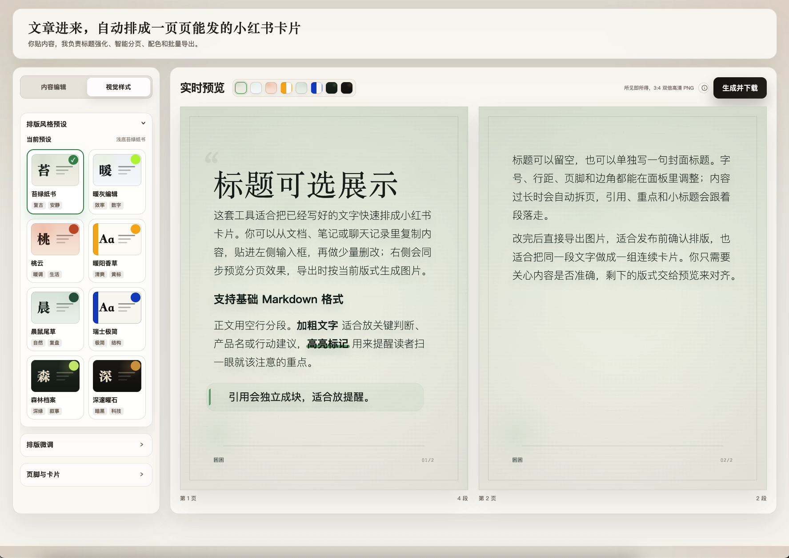

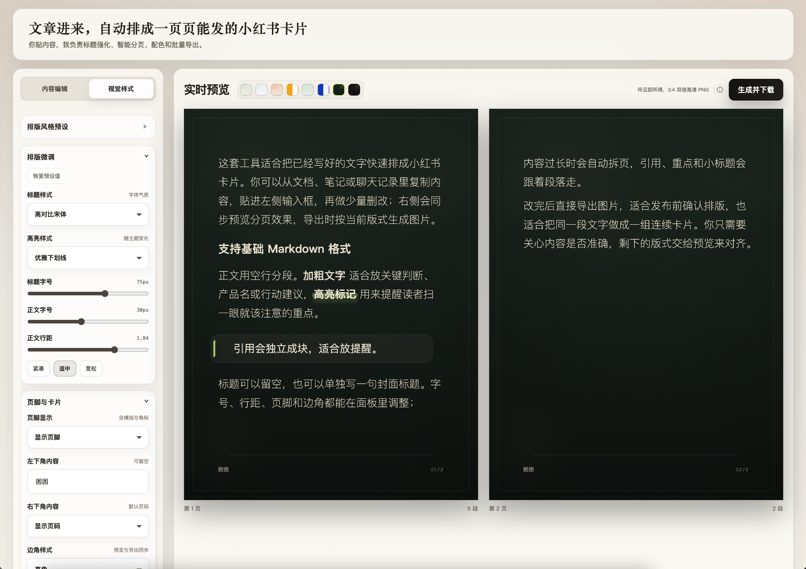

## 快速开始

先确认电脑里已经安装 Node.js。建议使用 Node.js 20 或更新版本。

```bash
git clone https://github.com/LuKK351/lukk-xhs-poster-studio.git
cd lukk-xhs-poster-studio
npm install
npm run dev
```

启动后打开：

```text
http://localhost:3000
```

如果你不熟悉命令行，可以把上面的命令和报错直接交给 Codex、Claude Code 或其他 AI 编程工具，让它帮你在本机启动。

## 常用命令

```bash
npm run dev
```

本地开发启动。

```bash
npm run build
```

检查项目能否正常构建。

```bash
npm run start
```

启动已经构建过的生产版本。需要先运行 `npm run build`。

```bash
npm test
```

运行项目里的静态行为检查，防止默认内容、主题顺序、页脚和导出命名等关键行为被改坏。

## 使用方式

1. 在左侧“内容编辑”里填写标题和正文。
2. 正文用空行分段，可以写 Markdown 小标题、引用、加粗和高亮。
3. 切到“视觉样式”，选择主题。
4. 需要时展开“排版微调”或“页脚与卡片”做细节调整。
5. 点击“生成并下载”，每张卡片会按顺序下载成 PNG。

## 导出命名规则

如果填写了标题，导出文件会类似：

```text
我的标题-01-20260625-132455.png
我的标题-02-20260625-132455.png
```

如果没有填写标题，会使用默认品牌名：

```text
LuKK-小红书卡片-01-20260625-132455.png
```

## 公开说明

项目没有后端服务，不会上传你的内容。所有排版和导出都在浏览器本地完成。

## License

MIT
